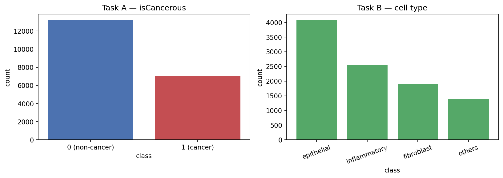
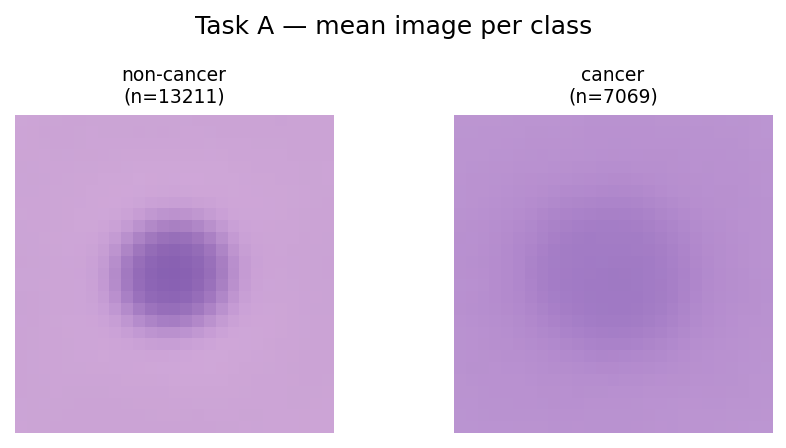
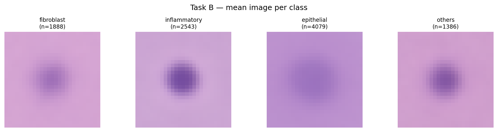
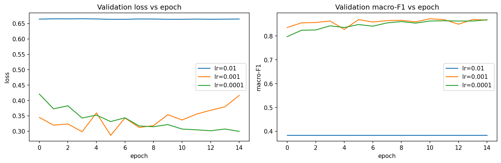
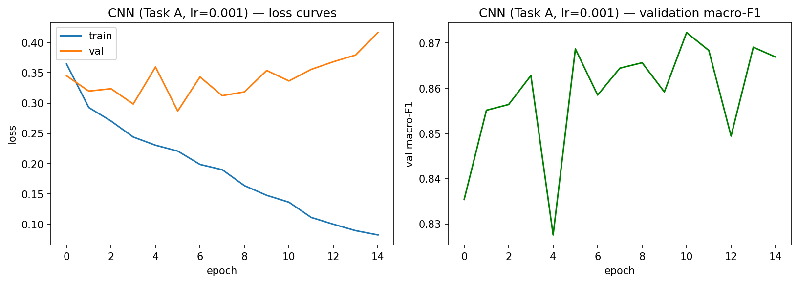
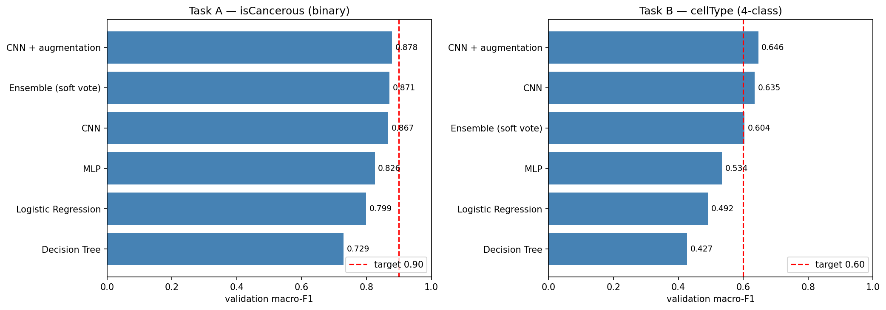
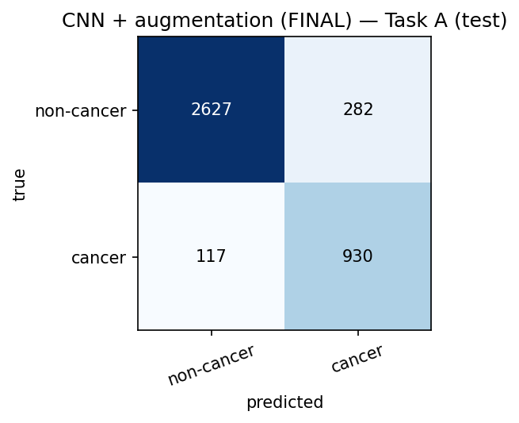
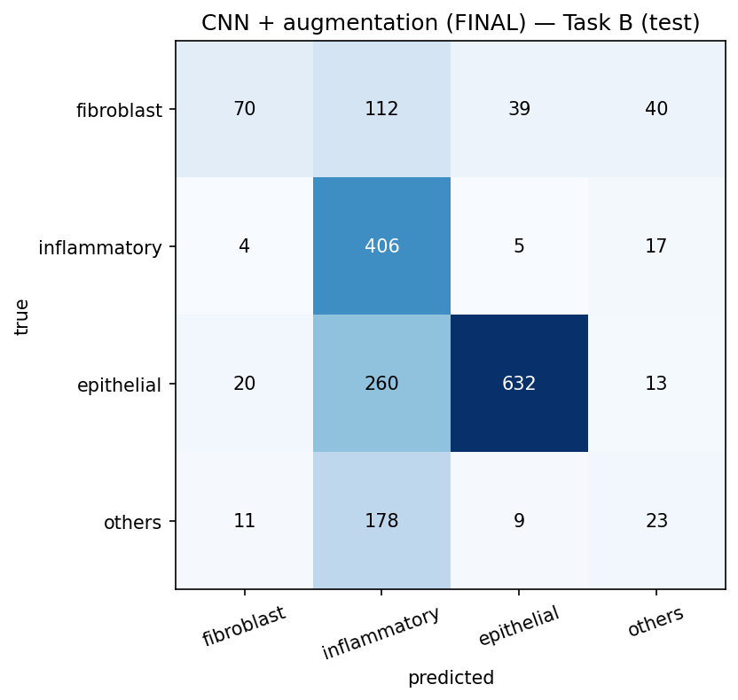

# Classifying Colorectal Cancer Cells from Histopathology Images

**COSC2793 Computational Machine Learning — Assignment 3**
Student ID: s4098368

---

## 0. Introduction

This report addresses two classification problems on a modified version of the
CRCHistoPhenotypes dataset, a collection of small histopathology image patches each
centred on a single colorectal cell. The first task is binary: decide whether a cell is
cancerous. The second is a four-way problem: assign each cell to one of epithelial,
inflammatory, fibroblast or other. Both matter clinically because the manual counting
and typing of cells on a slide is slow, repetitive work, and a reliable automatic
classifier would let a pathologist spend their time where it is most needed.

The work is organised around two ideas that turned out to dominate every result. The
first is that the images carry genuine non-linear structure, so model capacity helps up
to a point but no further. The second, and more important, is that the data is grouped
by patient, and honest evaluation has to respect that grouping. Throughout the report I
keep returning to the difference between how a model looks on a validation set and how
it behaves on patients it has never seen, because that gap is where the interesting
findings live.

All experiments use a fixed random seed (42) for reproducibility, and the notebook runs
end to end with a single "Restart and Run All".

## A. Task Definition

The two tasks share the same images but use different labels and different subsets of
the data.

**Task A — `isCancerous`.** A binary label is available for every image, so this task
uses the full dataset of 20,280 cells (the 9,896 fully-annotated "main" cells plus the
10,384 "extra" cells that carry only the cancer label). The classes are imbalanced, with
roughly 13,200 non-cancerous against 7,070 cancerous cells.

**Task B — `cellType`.** The four-way cell-type label exists only for the main data, so
this task uses the 9,896 main cells. The classes are more skewed still: epithelial
(4,079), inflammatory (2,543), fibroblast (1,888) and other (1,386).

One detail from the data shaped how I read every later result. In the main data the
count of cancerous cells is exactly 4,079, which is also the count of epithelial cells,
and inspection confirms these are the same cells. The cancerous cells *are* the
epithelial cells. Task A and the epithelial class of Task B are therefore describing the
same biological object from two angles, which is why the epithelial class later turns
out to be the easiest of the four to recognise.

The success criteria set for the assignment are a macro-averaged F1 of at least 0.90 for
Task A and at least 0.60 for Task B, measured on patients the model has never seen.
Macro-F1 is the right measure here precisely because the classes are imbalanced: it
weights every class equally, so a model cannot score well simply by getting the common
classes right and ignoring the rare ones.

## B. Dataset Description and Exploratory Data Analysis

Each image is a 27×27 RGB patch, which is small enough that a single cell fills most of
the frame but leaves little room for surrounding context. The dataset draws on 98
patients in total, 60 in the main data and 38 in the extra data.

### Class balance

Both tasks are imbalanced, and Task B severely so: the rarest class, *other*, has barely
a third of the examples of the most common, *epithelial*. This is not a nuisance to be
normalised away; it is a property of the biology, and it sets up the central difficulty
of Task B. A model trained on this distribution has every incentive to neglect the rare
classes, and as the results show, that is exactly what happens.

### What the average cell looks like

Averaging every image in a class gives a rough sense of how separable the classes are by
appearance alone. The two Task A means differ in a soft, diffuse way rather than in any
sharp feature, which already warns that a simple model working on raw pixels will
struggle. The Task B means are more distinct between epithelial and the rest, but
fibroblast and other look very similar to each other, foreshadowing the confusion the
classifiers later show between them.

### Unsupervised structure

To check whether the classes form natural groups in pixel space I flattened each image
to a 2,187-dimensional vector, reduced it with PCA, and ran k-means. The first two
principal components capture only 0.184 and 0.042 of the variance, so most of the signal
is spread thinly across many dimensions rather than concentrated in a few. More tellingly,
the k-means clustering agrees with the true cancer labels at an adjusted Rand index of
only 0.115, which is close to chance. The classes do not sit in tidy, linearly separable
blobs.

This is the single most useful thing the EDA tells us, and it is a prediction, not just a
description. If the classes are not linearly separable in pixel space, then linear models
and any classifier working on raw flattened pixels should do poorly, while a model that
can learn its own non-linear, spatially aware features should do markedly better. The
model comparison in Section F bears this out almost exactly.

## C. Data Pre-processing

### Patient-level splitting

The most important pre-processing decision is how to split the data. Cells from the same
patient are not independent: they come from the same tissue, were stained in the same
batch and imaged on the same scanner, so they share visual quirks that have nothing to do
with the label. If cells from one patient appear in both training and test sets, the
model can learn those quirks and the test score becomes a flattering measure of memory
rather than an honest measure of generalisation.

I therefore split by patient, not by image, using a grouped shuffle split into 60%
training, 20% validation and 20% test, with the constraint that no patient appears in more
than one set. The notebook verifies that the patient sets are disjoint for both tasks. The
consequence of this choice only becomes visible in Section G, where Task B's validation
and test scores diverge sharply, but the choice itself is what makes that divergence
trustworthy.

### Feature scaling

Two representations are needed. The classical models and the MLP take flattened pixel
vectors, which I standardise with a scaler fitted on the training data only. The
convolutional networks take the images as 3×27×27 tensors, normalised per colour channel
using means and standard deviations again computed only on the training set. Fitting these
statistics on training data alone, rather than on the whole dataset, keeps any information
about the validation and test patients out of the model.

## D. Model Development and Performance Analysis

For each task I built three models of increasing capacity, then tuned the strongest of
them. The aim was not only to find the best classifier but to watch how performance tracks
capacity, since the EDA gave a clear prediction about what that relationship should look
like.

### Classical baselines

A decision tree and logistic regression, both on standardised flattened pixels, form the
floor. The decision tree reached a validation macro-F1 of 0.729 on Task A and 0.427 on
Task B; logistic regression did better at 0.799 and 0.492. Both are well short of the
targets, which is the expected outcome: logistic regression can only draw linear
boundaries, and the decision tree splits one pixel at a time, so neither can express the
non-linear pixel interactions that the EDA showed are necessary.

### Multilayer perceptron

A two-hidden-layer MLP with dropout lifts validation macro-F1 to 0.826 on Task A and 0.534
on Task B. The jump over logistic regression is the direct payoff of non-linearity: the
hidden layers let the model combine pixels in ways a linear boundary cannot. But the MLP
still treats the image as an unstructured list of pixels and throws away the fact that
nearby pixels belong together, which is the gap the convolutional model closes next.

### Convolutional neural network and hyperparameter tuning

The CNN uses three convolution-and-pooling blocks followed by a small fully connected
head. Its inductive bias matches the data: convolution looks at local neighbourhoods and
shares weights across the image, so it can learn edge, texture and shape detectors that
are exactly the features a pathologist uses.

I tuned the learning rate over {0.01, 0.001, 0.0001}, training each setting with an
identical initialisation for a fair comparison.

A rate of 0.01 was unstable and 0.0001 learned too slowly within the epoch budget; 0.001
gave the best and steadiest validation macro-F1, so I used it for both tasks. The tuned
CNN reached 0.867 on Task A and 0.635 on Task B, comfortably the best of the three model
families and the first model to clear the Task B target.

The loss curves, however, revealed a problem.

The training loss keeps falling while the validation loss bottoms out around epoch five
and then drifts upward. This is textbook overfitting: the network has enough capacity to
start memorising the training patients rather than learning features that transfer. The
gap between the two curves is the variance term of the generalisation error made visible,
and it is the specific weakness that Section E sets out to fix.

The full set of per-model confusion matrices is in the notebook; the comparison in
Section F summarises the numbers.

## E. Advanced Techniques

The assignment asks for at least two advanced techniques. I use data augmentation and a
soft-voting ensemble. I initially planned transfer learning from CIFAR-10, but abandoned
it: pre-training a backbone on natural photographs is expensive, and the domain gap
between everyday images and stained tissue means only the lowest-level filters would
transfer. An ensemble reuses models I had already trained and is far cheaper, so it was
the better fit.

### E.1 Data augmentation

The plain CNN overfit, so the natural remedy is to enlarge the effective training set.
Before each pass, every training image is randomly flipped horizontally and vertically,
rotated by up to twenty degrees, and given a small brightness and contrast jitter. The
network therefore almost never sees the same pixels twice and cannot memorise individual
images; it is pushed instead toward features that survive these transformations.

These particular transformations are valid because a cell has no canonical orientation. A
nucleus rotated or mirrored is still the same nucleus of the same type, so the label is
preserved, and the brightness and contrast jitter imitates the real variation in staining
intensity between slides. This is why augmentation is safe here in a way it would not be
for, say, handwritten digits, where a mirrored image can change the label.

The effect on the loss curves is exactly what the theory predicts. The validation loss now
falls in step with the training loss instead of turning upward; the overfitting is gone.
The accuracy gain is modest, with macro-F1 rising to 0.878 on Task A and 0.646 on Task B,
because augmentation adds no new information and cannot raise the ceiling of what is
learnable from 27×27 patches. What it buys is not a higher ceiling but a steadier, more
trustworthy approach to it: a reduction in variance at a small cost in training accuracy.
Crucially, the augmented CNN is the best single model on *both* tasks.

### E.2 Ensemble by soft voting

The second technique averages the predicted class probabilities of three models: the MLP,
the tuned CNN and the augmented CNN. The reasoning is that these models carry different
inductive biases, the MLP seeing global pixel patterns and the CNNs seeing local spatial
structure, so they should make partly independent mistakes. Averaging predictors whose
errors are decorrelated cancels some of that error and reduces variance without adding
bias, which is the standard justification for ensembling.

It did not work. On Task A the ensemble scored 0.871, below the augmented CNN; on Task B it
dropped to 0.604, below even the plain CNN, and the rare *other* class got worse rather
than better. The reason is a condition that the standard justification quietly assumes:
the members must be not only diverse but comparably accurate. They are not. The MLP is much
weaker than the CNNs (0.826 against 0.867 on Task A, and 0.534 against 0.635 on Task B), so
giving it an equal vote pulls the average toward its mistakes. The bias injected by the
weak member outweighs the variance removed by averaging. A weighted vote, with each model
weighted by its validation score, would be the principled fix, but since the single
augmented CNN already beats the ensemble there is no reason to keep the heavier model.

This negative result is itself informative: it shows that ensembling is not a free upgrade
but a technique with a precondition, and that precondition was not met here.

## F. Model Comparison

| Model | Task A macro-F1 | Task B macro-F1 |
|---|---|---|
| Decision Tree | 0.729 | 0.427 |
| Logistic Regression | 0.799 | 0.492 |
| MLP | 0.826 | 0.534 |
| CNN | 0.867 | 0.635 |
| CNN + augmentation | **0.878** | **0.646** |
| Ensemble (soft vote) | 0.871 | 0.604 |

Read from the top down, the table tells a clean story up to the CNN. Each increase in
capacity buys an increase in performance, from the linear models, through the non-linear
but spatially blind MLP, to the spatially aware CNN. This is exactly the ordering the EDA
predicted: because the classes are not linearly separable in pixel space, the models that
can learn richer, local features win.

Past the CNN, though, capacity stops being the lever. Augmentation gives the best model on
both tasks, but it does so by regularising the CNN rather than by adding capacity, and the
ensemble, which is the most complex option of all, is beaten by its own best member. The
lesson is that complexity helps only while it lets the model express structure it could not
express before; once the model is already expressive enough, the remaining gains come from
better generalisation, not from more parameters.

The augmented CNN is therefore the final model for both tasks. It is the strongest on
validation, and it is a single interpretable model rather than a three-model committee that
bought nothing.

## G. Final Model Selection and Evaluation

Having chosen the augmented CNN on the basis of validation performance, I evaluated it once
on the held-out test patients. This is the only time the test set is used, so the figures
below are an unbiased estimate of how the model would perform on genuinely new patients.

### Task A

Task A generalises almost perfectly. Validation and test macro-F1 are 0.878 and 0.876, a
gap of just 0.002, and the model reaches 90% accuracy while correctly identifying 89% of
cancerous cells. That tiny gap is the reward for patient-level splitting: it confirms the
validation score was honest and that the model learned transferable features rather than
patient-specific quirks.

The model nonetheless lands a little below the 0.90 macro-F1 target. I read this as a real
ceiling rather than a failure of tuning. At 27×27 pixels some cells are genuinely
ambiguous, the EDA already showed that cancerous and non-cancerous cells overlap in pixel
space, and an irreducible error follows from that overlap no matter how the model is
trained. The remaining error is also the safer kind to skew, since the model's recall on
cancerous cells (0.888) is higher than its precision (0.767), meaning it errs toward
flagging rather than missing.

### Task B

Task B tells the opposite story and is the more important finding. Validation macro-F1 was
an acceptable-looking 0.646, but on held-out patients it collapses to 0.475, well short of
the 0.60 target and a gap of 0.17. Four separate effects stack up to produce that
collapse, and Task A escapes all of them.

The first is that the validation score was optimistic from the start. I chose the
augmented CNN and its learning rate by reading the validation numbers, and the moment a
model is selected for scoring well on a set, that score stops being an honest estimate of
generalisation: it now reflects a model partly fitted to the quirks of those particular
validation patients. The test set was used for no decision at all, so the drop from 0.646
to 0.475 includes the optimism being stripped away. On its own this would explain a small
gap, not a collapse; the remaining three effects are what make Task B fall so much further
than Task A.

The second, and the deepest, is the nature of the question. Task A relies on coarse,
broadly universal cues, since cancerous epithelial cells are large and dark in a way that
looks similar across patients, and that is why its validation and test scores are almost
identical. Task B asks a far finer question, separating fibroblast from *other* from
inflammatory on the basis of subtle shape and texture that genuinely differs from one
patient to the next with tissue, staining batch and scanner. The model learned what those
types look like in the *training* patients, and that knowledge did not transfer. The
confusion matrix shows the consequence directly: faced with unfamiliar patients the model
retreats to the easy, common class, flooding inflammatory to a recall of 0.94 at a
precision of only 0.42. This is classic distribution shift, a decision boundary that fit
the training patients sitting in the wrong place for the new ones.

The third effect is that the rare classes live in very few patients. The patient-level
split leaves roughly thirty-six training patients, and the rarest classes, *other* with
1,386 cells and fibroblast with 1,888, are spread across only a handful of them. With so
few patients carrying these cells, the model cannot learn what is common to a fibroblast
*across* people; it learns what fibroblasts looked like in those specific patients. When
the test patients' rare cells differ even slightly, there is no general rule to fall back
on, and the rare classes crater, with *other* scoring an F1 of 0.15 and fibroblast a recall
of just 0.27. Only the epithelial class, the most common and, as noted in Section A, the
same cells as the cancerous label, stays reliable at an F1 of 0.79.

The fourth effect multiplies the third. Macro-F1 averages the four classes equally, by
design, so that a model cannot hide a neglected minority behind the common classes. That is
the correct metric for an imbalanced problem, but it also means that when the two rare
classes collapse on test, they drag the whole score down out of proportion to their size.
On validation those rare classes happened to do passably, because the validation patients'
rare cells resembled the training ones; on test they did not, and macro-F1 turned that into
a large fall.

Taken together, the honest estimate of this model's cell-typing ability on a new patient is
0.475, not the 0.646 that validation suggested, and only because the test patients were
kept entirely separate does this show up at all. Had I split by image, leakage would have
hidden the whole story and I would have reported a number the model could not deliver in
practice. The gap is not a flaw in the experiment; it *is* the finding.

Closing this gap would take more than augmentation. The most promising directions are
class-balanced training to stop the rare classes being drowned out, and, more
fundamentally, a larger and more varied set of patients so the model can learn what is
common to a cell type across people rather than what is incidental to the patients it
happened to train on.

## H. Ethical Considerations and Professional Responsibilities

The images come from real colorectal cancer patients, and although the data is
de-identified it remains sensitive medical information. I have restricted its use to this
coursework and have not redistributed it.

The graver concern is what these models would mean if anyone deployed them. Neither is a
medical device, and the test results show why that distinction matters. On Task A the model
still misses about one cancerous cell in nine, and a missed cancer is the most costly error
a screening tool can make. Task B does not transfer to new patients at all. At best a tool
like this could assist a pathologist by flagging cells for a second look; presenting it as
diagnostic would be both unsafe and dishonest.

The models also inherit the limits of their data. Ninety-eight patients from a single
source represent a narrow slice of the variation found in practice, where staining
protocols, scanners and patient populations all differ, and there is no basis for assuming
the model behaves fairly on groups it never saw. Task B's collapse on unseen patients is
direct, measured evidence of that fragility.

Professional responsibility, finally, means reporting these limits plainly rather than
quoting the kinder validation figures. I report Task B's honest test score of 0.475, and I
chose a single CNN over the ensemble partly because one model is easier to scrutinise than
a committee, while acknowledging that any CNN remains difficult to interpret and would need
saliency analysis and human oversight before it came near a clinic.

## I. Conclusion

This project compared models of increasing capacity on two histopathology tasks under a
strict patient-level evaluation. The EDA predicted, and the results confirmed, that
convolutional models would outperform linear and flat ones because the classes are not
linearly separable in pixel space. Data augmentation produced the best single model on both
tasks by curing the CNN's overfitting rather than by adding capacity, while the soft-voting
ensemble failed because its weakest member dragged the average down, a reminder that
ensembling requires members of comparable skill.

The decisive lesson came from the test set. Task A generalised almost perfectly, reaching a
test macro-F1 of 0.876 just short of the 0.90 target, but Task B fell from 0.646 on
validation to 0.475 on unseen patients. Validation alone would have concealed this, and
only patient-level evaluation revealed that the cell-type model does not transfer between
patients. The honest conclusion is that the binary cancer task is close to solved at this
resolution, while reliable cell typing will need class-balanced training and, above all,
more patients.

## J. References

Sirinukunwattana, K., Raza, S.E.A., Tsang, Y.-W., Snead, D.R.J., Cree, I.A. and Rajpoot,
N.M. (2016). Locality Sensitive Deep Learning for Detection and Classification of Nuclei in
Routine Colon Cancer Histology Images. *IEEE Transactions on Medical Imaging*, 35(5),
pp.1196–1206.

Goodfellow, I., Bengio, Y. and Courville, A. (2016). *Deep Learning*. MIT Press.

Shorten, C. and Khoshgoftaar, T.M. (2019). A survey on Image Data Augmentation for Deep
Learning. *Journal of Big Data*, 6(1), pp.1–48.

Dietterich, T.G. (2000). Ensemble Methods in Machine Learning. In *Multiple Classifier
Systems*, Lecture Notes in Computer Science, vol. 1857. Springer, pp.1–15.

Paszke, A. et al. (2019). PyTorch: An Imperative Style, High-Performance Deep Learning
Library. *Advances in Neural Information Processing Systems 32*, pp.8024–8035.

Pedregosa, F. et al. (2011). Scikit-learn: Machine Learning in Python. *Journal of Machine
Learning Research*, 12, pp.2825–2830.
