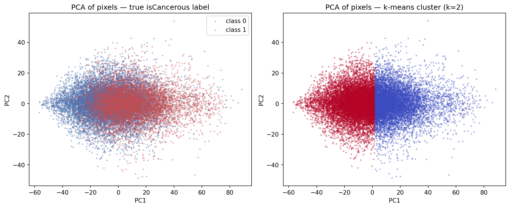
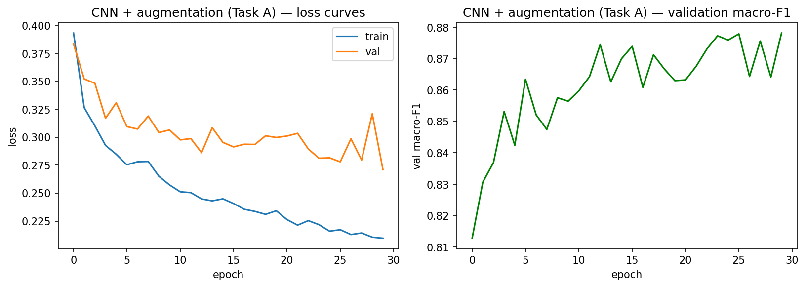

<!--
HOW TO USE
- Each slide has SPEAKER NOTES in the comment block below it — say these, don't read the slide.
- Target 5-8 min. Suggested timing is in [brackets] per slide; total ~6:30.
- To export: VS Code "Marp for VS Code" extension → Export Slide Deck → PDF/PPTX/HTML.
- Have plots/ open in case you want to point at a figure live.
- Mic + camera ON. Speak to the camera, glance at notes.
-->

# Classifying Colorectal Cancer Cells from Histopathology Images

**COSC2793 — Assignment 3**
Student s4098368

<!--
[0:20] Hi, I'm <name>. This is my image-classification project on colorectal
histopathology cells. I'll cover the two tasks, the data, the models I built, the
two advanced techniques I tried, and the honest final results on unseen patients.
-->

---

## 0 + A. The two tasks

- **27×27 RGB** cell images from the CRCHistoPhenotypes dataset, **20,280 images, 98 patients**
- **Task A — isCancerous (binary):** cancer vs non-cancer · target **macro-F1 ≥ 0.90**
- **Task B — cellType (4-class):** epithelial / inflammatory / fibroblast / other · target **≥ 0.60**
- Both **class-imbalanced** → I score with **macro-F1** (every class counts equally)

<!--
[0:45] Two classification tasks on the same images. Task A is binary — is the cell
cancerous. Task B is the harder one, four cell types. Both classes are imbalanced,
so I use macro-F1 throughout, which weights every class equally and won't let a model
hide a neglected minority behind the common classes. The targets are 0.90 and 0.60.
-->

---

## B. Data & EDA — the key finding

- PCA: top 2 components explain only **18.4% + 4.2%** of pixel variance
- k-means (k=2) vs true labels: **ARI 0.115** — near chance, splits on staining not cancer
- **→ classes are NOT linearly separable in raw pixels** — signal is in local texture/shape

<!--
[0:55] Before modelling I ran an unsupervised check. PCA shows variance is spread across
many directions, not a few. And k-means, left to find its own structure, scores near
chance against the true labels — it groups by staining intensity, not by cancer. The
takeaway drives everything after: the class signal isn't in raw pixels linearly, it's in
local nuclear texture and shape. So I expected flat models to underperform and CNNs to win.
-->

---

## C. The one methodology rule that matters

**Patient-level split** with `GroupShuffleSplit` on `patientID` — 60 / 20 / 20

- A patient's cells share staining, illumination, tissue → a random split would leak them across train/test
- That **group leakage** gives an inflated, dishonest score
- Test patients are **completely unseen**, touched **once** at the end

<!--
[0:40] The single most important decision. Cells are grouped by patient, and a patient's
cells look alike. If I split images randomly, the same patient lands in train and test, and
the model scores well by recognising the patient, not the biology — group leakage. So I split
by patient: every patient's cells stay in one split, and the test patients are never seen
until the final evaluation. This is what makes my numbers honest.
-->

---

## D. Models — complexity climbs, performance climbs (to a point)

| Model | Task A | Task B |
|---|---|---|
| Decision Tree | 0.729 | 0.427 |
| Logistic Regression | 0.799 | 0.492 |
| MLP | 0.826 | 0.534 |
| **CNN** | **0.867** | **0.635** |

- Same ranking both tasks → **confirms the EDA**: spatial structure is the signal
- LogReg **beats** the unconstrained Tree → bias–variance: the Tree overfits 2,187 noisy pixels
- MLP is non-linear but **flattens** the image → stalls; CNN keeps geometry → wins

<!--
[0:55] I built four models per task, simple to complex. The ranking is identical on both:
Tree, LogReg, MLP, CNN. Two theory points. First, logistic regression beats the decision
tree — the simpler model wins because the unconstrained tree overfits two thousand noisy
pixel features. Classic bias-variance. Second, the MLP is non-linear but it flattens the
image and throws away layout, so it stalls around 0.83; the CNN keeps the spatial structure
and is clearly best. Exactly what the EDA predicted. But the CNN overfits — its validation
loss rises — which motivates the advanced techniques.
-->

---

## E. Advanced technique 1 — Data augmentation ✓

- Flips + rotations are **label-preserving** for cells (no canonical orientation) → free regularisation
- Fixes the CNN overfitting: train/val loss now track together
- **Task A 0.867 → 0.878 · Task B 0.635 → 0.646** — best model on both

<!--
[0:45] First technique: data augmentation. Cells have no up or down, so flips and rotations
are label-preserving — they give the network more effective variety for free. This cured
the overfitting: train and validation loss now move together instead of diverging, and it
became my best model on both tasks. On Task B it specifically helped the rare 'other' class,
raising its recall, though it also made the model over-predict inflammatory — augmentation
redistributes errors more than it removes them.
-->

---

## E. Advanced technique 2 — Soft-voting ensemble ✗

- Averaged MLP + CNN + augmented-CNN probabilities — **it did not work**
- Task A 0.871 (< 0.878) · Task B 0.604 (< 0.635) — **below its own best member**
- **Why:** ensembling assumes members are *comparably accurate*; the MLP (0.826/0.534) is too weak and drags the average down
- Fix: weight votes by validation F1 — but the single augmented CNN already wins

<!--
[0:45] Second technique: a soft-voting ensemble. Honestly, it failed — it scored below its
own best member. That's a useful negative result. Ensembling only helps when members are
diverse AND comparably accurate; my MLP is much weaker than the CNNs, so giving it an equal
vote pulls the average toward its mistakes. The principled fix is to weight votes by
validation score, but since the single augmented CNN already beats the committee, I keep the
simpler model. Complexity isn't a free upgrade — it has a precondition that wasn't met.
-->

---

## G. Final evaluation on UNSEEN patients — two stories

| | Validation | **Test** | Gap |
|---|---|---|---|
| **Task A** | 0.878 | **0.876** | 0.002 ✓ generalises |
| **Task B** | 0.646 | **0.475** | 0.17 ✗ collapses |

- **Task A:** near-perfect transfer, 90% acc, 89% cancer recall — just under 0.90 (a real pixel-resolution ceiling)
- **Task B:** validation was optimistic; on new patients it floods inflammatory, rare classes crater (*other* F1 0.15)
- **The 0.17 gap is the finding** — the patient split made distribution shift visible

<!--
[0:55] Final model, the augmented CNN, evaluated once on held-out patients. Two opposite
stories. Task A transfers almost perfectly — validation 0.878, test 0.876, a two-thousandth
gap, catching 89% of cancer cells. Just under the 0.90 target, but that's a genuine ceiling
at 27-pixel resolution, not a tuning failure. Task B does NOT transfer — it falls from 0.646
to 0.475 and misses the target. Cell-type appearance varies enough between patients that the
model doesn't carry over; it retreats to the common class. Had I split by image instead of
patient, leakage would have hidden this entirely. The gap isn't a flaw — it IS the finding.
-->

---

## H. Ethics + Conclusion

- **Ethics:** false negatives (missed cancer) are the dangerous error; honest reporting of the failing Task B score matters more than a flattering one. A model at 0.475 must not be deployed for cell typing.
- **Conclusion:** Task A is reliable (0.876); Task B needs **class-balanced training + more patients**, not more model capacity
- **The discipline of patient-level evaluation is what separates a real result from an illusion**

<!--
[0:45] Two closing points. Ethics: in this domain the dangerous error is a missed cancer,
a false negative, which is why I weight recall and report Task B's honest failing score
rather than the kinder validation number — a 0.475 model shouldn't be deployed. Conclusion:
Task A is reliable; Task B's ceiling is data, not modelling — more patients and balanced
training. And the broader lesson is that evaluating on unseen patients is what makes the
result trustworthy. Thanks for watching.
-->
